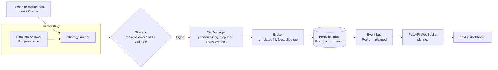

# AI Trader

An AI-assisted crypto trading agent, built as a learning project and portfolio
piece: pluggable trading strategies, a realistic paper-trading and backtesting
engine, and a real-time dashboard — with a clear path toward a real
multi-tenant SaaS product later.

**Live demo:** [crypto-trading-bot-app.vercel.app](https://crypto-trading-bot-app.vercel.app/)

> **This is paper trading only. Nothing here executes real trades, and
> nothing in this repo is financial advice.**

## Status: work in progress

This project is being built in public, in phases, and this README will be
updated as it grows. Where things stand right now:

| Piece | Status |
|---|---|
| Strategy engine (MA crossover, RSI, Bollinger Bands) | Implemented |
| Broker execution simulation (fees/slippage/ledger) | Implemented |
| Risk manager (position sizing, stop-loss, drawdown halt) | Implemented |
| Historical data loader (Kraken via `ccxt`, Parquet cache) | Implemented |
| Backtesting engine + metrics (Sharpe, drawdown, win rate, ...) | In progress |
| Dashboard UI (candlestick chart, portfolio, live signal feed) | Implemented — currently running on a **mock data simulator**, not connected to the backend yet |
| Real backend API + WebSocket streaming | Not started |
| Live paper-trading loop against real market data | Not started |
| Persistence (Postgres) | Not started |
| Multi-user accounts / billing (future SaaS) | Not started, intentionally deferred |

In short: the backend has real, working building blocks but nothing runnable
end-to-end yet, and the dashboard is a fully working visual preview wired to
fake data so the UI could be iterated on before the API exists. These two
halves get connected in an upcoming phase.

## Architecture



The backtester and the live paper-trading loop are designed to share the
exact same `Strategy` → `RiskManager` → `Broker` code path — only the price
source changes (historical candles vs. a live feed). That reuse is deliberate:
a strategy that backtests well runs through identical execution logic live.

## Tech stack

- **Backend**: Python 3.12, FastAPI (planned), `ccxt` for exchange data,
  SQLAlchemy + Postgres (planned), Redis (planned)
- **Frontend**: Next.js 14 (App Router), TypeScript, Tailwind CSS,
  [`lightweight-charts`](https://github.com/tradingview/lightweight-charts) for
  candlestick/equity charts, Framer Motion for the live signal feed
- **Default exchange**: Kraken (its public market data endpoints are
  unauthenticated and not geofenced, unlike Binance for US-based access)

## Repository structure

```
backend/
  app/
    strategies/   # Strategy interface + MA crossover, RSI, Bollinger Bands
    engine/       # Broker (fills/fees/slippage), RiskManager, StrategyRunner
    data/         # Historical OHLCV loader (ccxt + Parquet cache)
    backtest/     # Backtesting engine + performance metrics (in progress)
  scripts/        # CLI entry points (in progress)
  tests/
frontend/
  app/dashboard/  # Dashboard page
  components/     # CandlestickChart, EquityCurve, PortfolioCard, SignalFeed, ...
  lib/            # Mock market simulator (temporary stand-in for the real API)
docs/
```

## Running it today

**Dashboard (mock data demo):**

```bash
cd frontend
npm install
npm run dev
```

Then open `http://localhost:3000/dashboard`. Prices tick every second and the
built-in strategy will fire a simulated BUY/SELL within the first minute or
so of watching.

**Backend:** strategy/engine unit tests can be run with `pytest`, but there is
no CLI or API entry point yet — that lands with the backtesting engine.

## Roadmap

1. ~~Core strategy/broker/risk-manager engine~~
2. Backtesting engine + metrics, runnable from a CLI against real historical
   Kraken data *(current focus)*
3. Postgres persistence + a live paper-trading loop against real market data
4. FastAPI + WebSocket API; reconnect the dashboard from mock data to the
   real API
5. Polish, docs, CI, one-command `docker compose up` demo
6. **Future**: real user accounts, Stripe billing, multi-tenant SaaS
   conversion
